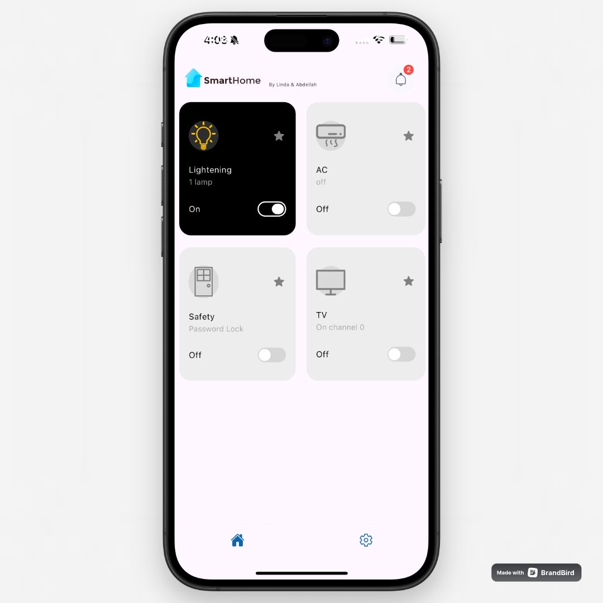
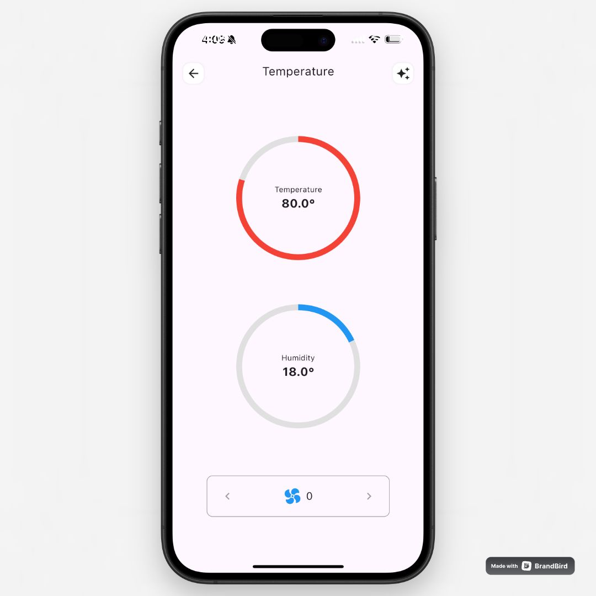
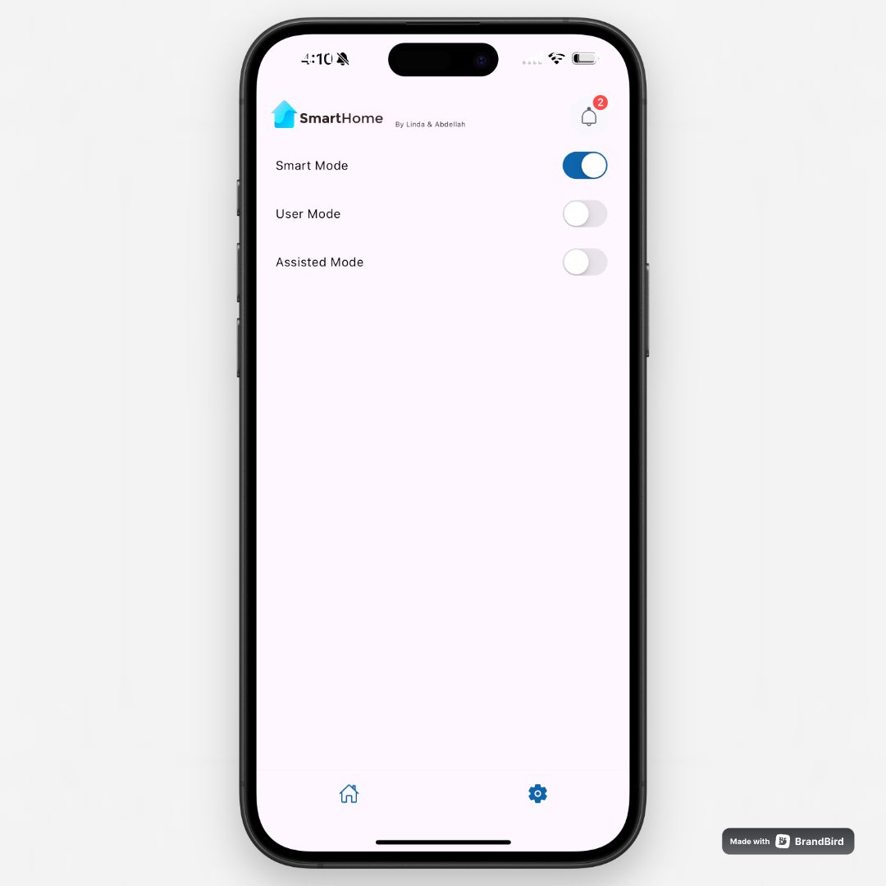

# 🏠 SmartHome AI Controller

A powerful smart home control system built with Flutter, featuring AI-driven automation and real-time IoT device control.


## Overview

SmartHome AI Controller is an intelligent home automation solution that combines the power of Flutter's smooth UI with machine learning capabilities. The app offers three distinct control modes, allowing users to either manually control their smart devices, receive AI-powered suggestions, or enable full automation based on learned habits.

## ✨ Features

### Control Modes
- **Manual Mode**: Direct device control through an intuitive mobile interface
- **Auto Mode**: ML-powered automation that learns from your habits over 15 days
- **Semi-Auto Mode**: AI suggests actions via notifications, awaiting your approval

### Smart Device Control
- 💡 Light Control: Toggle and adjust brightness
- 🌪️ Fan Management: Variable speed control
- 📺 TV Control: Channel switching and basic functions
- 🔒 Smart Door: Secure access with password protection
- ⚡ Real-time Updates: Instant device state synchronization

## 🏗️ System Architecture

The app is part of a larger smart home ecosystem:
- **Frontend**: Flutter mobile application (this repository)
- **Backend**: Django REST API with ML capabilities ([Backend Repository](https://github.com/Mromeiri/smart-home-backend))
- **IoT Layer**: HTTP communication with smart devices
- **AI Component**: Machine learning model for habit analysis and automation

## 📱 Screenshots

| Home Dashboard | Device Control | Mode Settings |
|---------------|----------------|---------------|
|  |  |  |

## 🚀 Getting Started

### Prerequisites
- Flutter (latest version)
- Android Studio / Xcode
- Git

### Installation

1. Clone the repository:
```bash
git clone https://github.com/Mromeiri/smart_home-flutter-project.git
cd smart_home-flutter-project
```

2. Install dependencies:
```bash
flutter pub get
```


3. Run the application:
```bash
flutter run
```

## 🔧 Configuration

The app requires connection to a Django backend server. Ensure your backend is properly configured and running before launching the app. See the [backend repository](https://github.com/Mromeiri/smart-home-backend) for server setup instructions.

## 🤝 Contributing

1. Fork the repository
2. Create your feature branch (`git checkout -b feature/amazing-feature`)
3. Commit your changes (`git commit -m 'Add amazing feature'`)
4. Push to the branch (`git push origin feature/amazing-feature`)
5. Open a Pull Request

## 📄 License

This project is licensed under the MIT License - see the [LICENSE](LICENSE) file for details.

## 🙏 Acknowledgments

- Special thanks to all contributors
- Built using Flutter framework
- Backend powered by Django
- IoT implementation based on HTTP protocol

## 📞 Contact

omeiri.abdellah@gmail.com

---

<div align="center">
  Made with Omeiri Abdellah & Linda Benhocine
</div>
